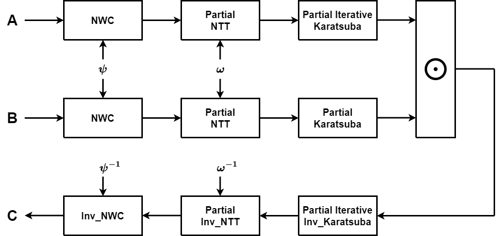
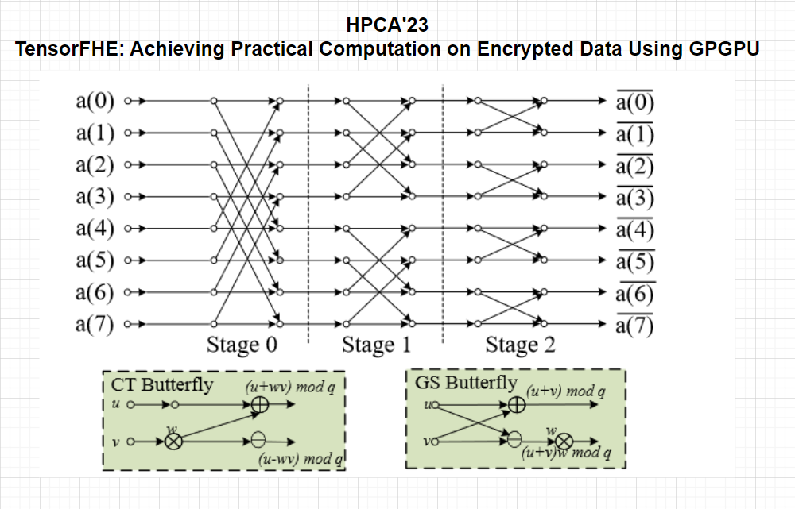
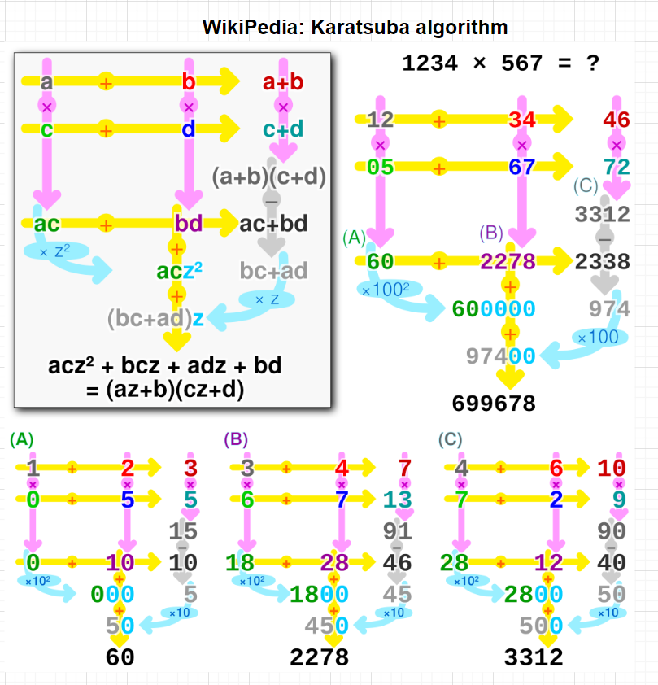

# Polynomial Multiplication Accelerator for FHE

## 1 Introduction and Modeling

### 1.1 Polynomial multiplication

- Considering 2 N-degree polynomials:

$$
\left\{ \begin{matrix}
A = a_0x^0+a_1x^1+...+a_{N-1}x^{N-1} \\
B = b_0x^0+b_1x^1+...+b_{N-1}x^{N-1}
\end{matrix}\right.
$$

- We perform multiplication on polynomial rings:

$$
R_q = \mathbb{Z}_q[x]/(x^N+1)
$$

- So that we can get the result:

$$
C = A\times B = c_0x^0+c_1x^1+...+c_{N-1}x^{N-1}
$$

### 1.2 Solution system

1. The most traditional method for solving such a polynomial multiplication is the naive approach learned in school.
   - In this method, we multiply corresponding elements and sum them according to their respective indices.
   - The computational complexity of this method is $O(N^2)$
2. To accelerate the computation of polynomial multiplication, modern research always empolys the **Number Theoretic Transform (NTT)**, which is an adaption of the FFT that operates in a finite field.
   - Just like FFT, NTT transforms a polynomial into a point-value representation, enabling efficient multiplication in the frequency domain.
   - The computational complexity of this method is $O(NlogN)$
3. The Karatsuba algorithm, originally developed for fast multiplication of large integers, can be adapted for polynomail multiplication.
   - It leverges the divide-and-conquer strategy to reduce the number of multiplications required, replacing some of them with additions and subtractions, which are computationally cheaper.
   - The computational complexity of this method is $O(N^{log_23})\approx O(N^{1.585})$
   - We develop the recursive nature of the Karatsuba algorithm, resulting in the **Iterative Karatsuba Algorithm**, which is highly parallelizable, allowing for optimization on multi-core processors.

---

- Based upon the 3 methods, the classic solution system of polynomial multiplication is shown below, where $\odot$ represents element-wise multiplication.

$$
INTT(NTT(A) \odot NTT(B))
$$

---

- ***Our IDEA: Partial NTT + Partial Iterative Karatsuba***
  

### 1.3 Methods

- NTT
  
- Karatsuba
  

### 1.4 Parameter defines

- N = 65536
  - degrees of polynomials
  - n = 16
  - $O(2^{16})$
- K = 32
  - data width of coeffitients and modular number
  - (bit)
- q = 998244353
  - modular number
- phi = 629671588
  - `pow(phi, n, q) == 1`
- phi_inv = 283043518
  - `phi * phi_inv % q == 1`
- psi = 24514907
  - `pow(psi, n, q) == -1`
  - `pow(psi, 2*n, q) == 1`
  - `pow(psi, 2, q) == phi`
- psi_inv = 3707709
  - `psi * psi_inv % q == 1`
- N_inv = 998229121
  - `N * N_inv % q == 1`
- inv_2 = 499122177
  - `2 * inv_2 % q == 1`

## 2 Computation Resources Evaluation

### 2.1 NTT/INTT (m stages)(1 group)

- Modular Multiplication: $m\cdot \frac{N}{2}$
- Modular Add/Sub: $m\cdot N$

### 2.2 Iterative Karatsuba (m stages)(n-m groups)

- Modular Add: $2^{n-m}\cdot \sum^{m-1}_{k=0} 2^{m-1}\cdot (\frac{3}{2})^k$
  - summation of geometric progression: $2^{n-m}\cdot 2^m\cdot (\frac{3}{2}^m-1)$

### 2.3 Iterative Inv_Karatsuba (m stages)(n-m groups)

- Modular Add/Sub: $2^{n-m}\cdot \sum^{m-1}_{k=0} (2\cdot (2^{k+1}-1) + 2\cdot (2^k-1))$
  - summation of geometric progression: $2^{n-m}\cdot (6\cdot (2^m-1)-4m)$

### 2.4 Scheme-1: 2*NTT + odot + INTT

- Modular Multiplication: $3m\cdot \frac{N}{2}  +  N$
- Modular Add/Sub: $3m\cdot N$

### 2.5 Scheme-2: 2*Kara + odot + Inv_Kara

- Multiplication: $2^{n-m}\cdot 3^m$
- Modular Add/Sub: $2^{n-m}\cdot (2\cdot 2^m\cdot (\frac{3}{2}^m-1)  +  6\cdot(2^m-1)-4m)$

### 2.6 MM vs MA

- Taking K=32bit as an example:
  - Modular Add/Sub: O(3)
  - Multiplication: O(32)
  - Modular Multiplication: O(100)
